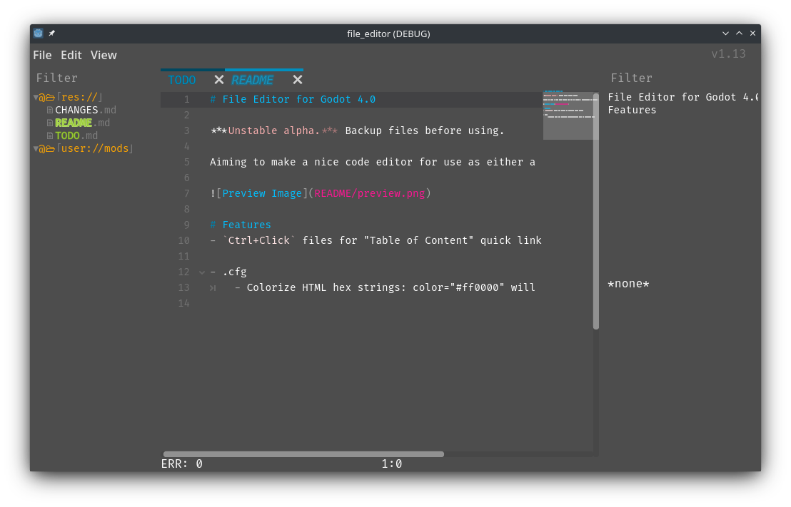

# File Editor for Godot 4.0

***Unstable alpha.*** Backup files before using.

Aiming to make a nice code editor for use as either a standalone, or inside a game/program.

# Features
- `Ctrl+Click` files for "Table of Content" quick links.

- .cfg
	- Colorize HTML hex strings: color="#ff0000" will be colorized red.
